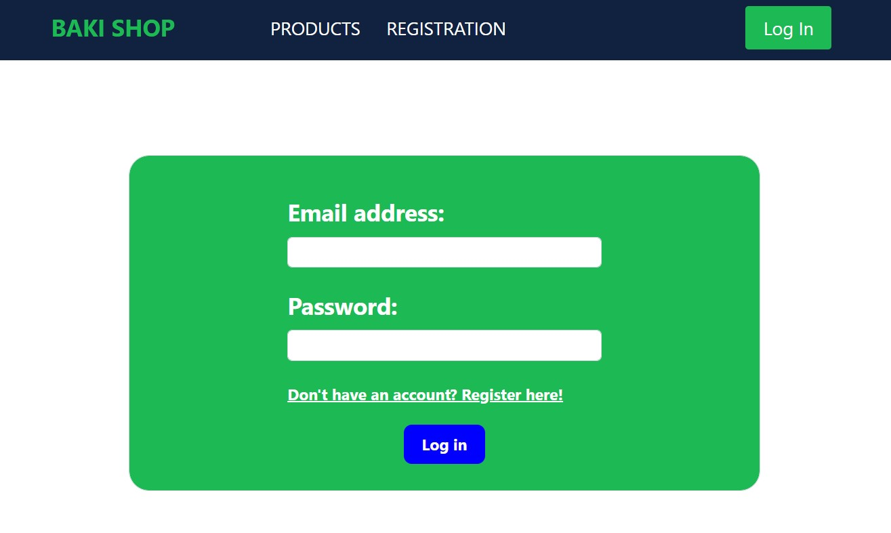
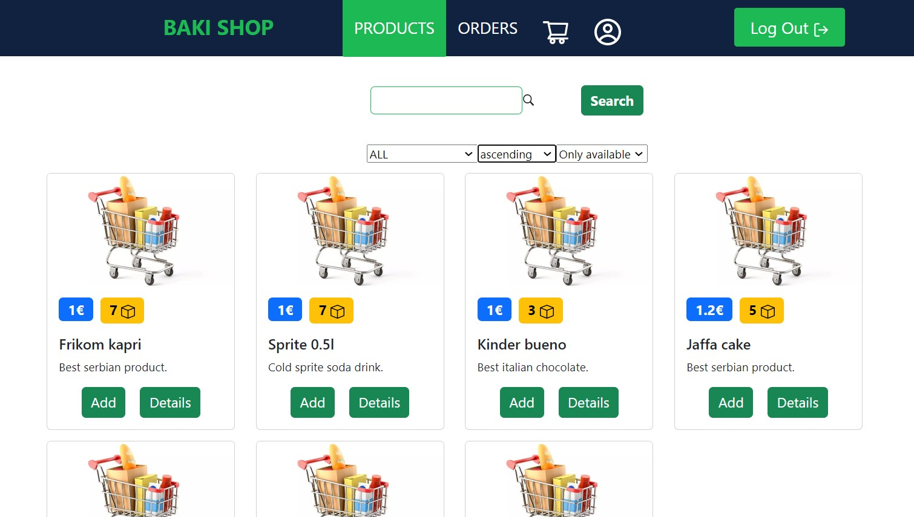
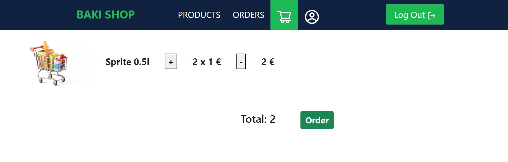
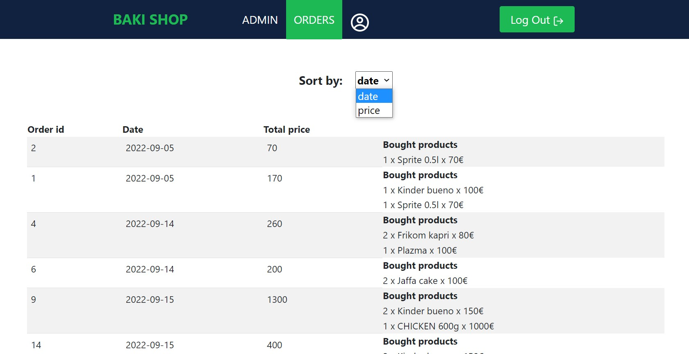

Simple e commerce app built using Scala, Play framework, React JS and PstgreSQL.

<h1 align="center">
  BakiShop Application
   
</h1>

  • <a href="#-project-setup-and-commands">Novi Sad, September 2022</a>
  •

## 👨‍💻 Developer
    • Srđan Đurić           SW63-2019

## 🚀 Project setup

#### :warning: *Pre requirements:*

- Installed Node.js
- ReactJS
- JDK version 17
- PostgreSQL
- Scala plugin for InteliJ

#### :floppy_disk: *How to run backend:*

- Open BakiShop backend app in IntelliJ IDE
- Download all needed dependencies
- Run setup.sql, createTables.sql and populateTables.sql from terminal/shell to create and populate DB
- Navigate to repositories and run CodeGen to generate needed database entities(There is need to change outputDir to your machine location)
- Run whole application by clicking run on 

#### :floppy_disk: *How to run frontend:*

- Open front-app in wanted IDE (VSCode, WebStorm etc.)
- Run npm install in terminal to install all needed dependencies
- Run ng start in terminal to start application

## 🤝 Useful to know:
- There are two types of user roles to login:
    - Admin (admin@gmail.com)
    - Regular user (srdjan@gmail.com)
- Password for all users is: 12345
- <b>Note that you will need to change configuration to connect to your local PostgreSQL Database</b>

## 📱 Some photos of application

